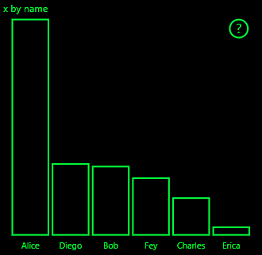
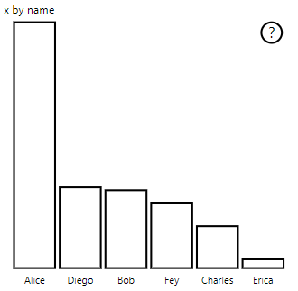

# Accessibility: Adding High-Contrast Mode Support
Windows *High-Contrast* setting makes text and apps easier to see by using more distinct colors.
Read more about [high-contrast support in Power BI](https://powerbi.microsoft.com/en-us/blog/power-bi-desktop-june-2018-feature-summary/#highContrast).

Adding high-contrast support to your visual requires the following:
1. On init: Detect whether Power BI is in high-contrast mode and if so, get current high-contrast colors.
2. Every update: Change the way the visual renders to make it easier to see.

See this [commit](https://github.com/Microsoft/PowerBI-visuals-sampleBarChart/commit/61011c82b66ca0d3321868f1d089c65101ca42e6) to learn how high-contrast was implemented in Sample Bar Chart, the files [src/barChart.ts](https://github.com/Microsoft/PowerBI-visuals-sampleBarChart/commit/61011c82b66ca0d3321868f1d089c65101ca42e6#diff-433142f7814fee940a0ffc98dc75bfcb) and [capabilities.json](https://github.com/Microsoft/PowerBI-visuals-sampleBarChart/commit/61011c82b66ca0d3321868f1d089c65101ca42e6#diff-290828b604cfa62f1cb310f2e90c52fd) contain the main changes. 

## On Init
The [colorPalette](./ColorPalette.md) member of `options.host` has several properties for high-contrast mode. Use these properties to determine whether high-contrast mode is active, and if so, what colors to use.

### Detect that Power BI is in high-contrast mode
If `host.colorPalette.isHighContrast` is `true`, high-contrast mode is active and the visual should draw itself accordingly.

### Get high-contrast colors
In high-contrast mode, your visual should limit itself to the following colors:
* **Foreground** color is used to draw any lines, icons, text and outline or fill of shapes.
* **Background** color is used for background, and as the fill color of outlined shapes.
* **Foreground - selected** color is used to indicate a selected or active element.
* **Hyperlink** color is used only for hyperlink text.

Note: If a secondary color is needed, foreground color may be used with some opacity (Power BI native visuals use 40% opacity). Use this sparingly to keep the visual details easy to see.

You can store these values during initialization:

```typescript
    private isHighContrast: boolean;

    private foregroundColor: string;
    private backgroundColor: string;
    private foregroundSelectedColor: string;
    private hyperlinkColor: string;
    //...

    constructor(options: VisualConstructorOptions) {
        this.host = options.host;
        let colorPalette: ISandboxExtendedColorPalette = host.colorPalette;
        //...
        this.isHighContrast = colorPalette.isHighContrast;
        if (this.isHighContrast) {
            this.foregroundColor = colorPalette.foreground.value;
            this.backgroundColor = colorPalette.background.value;
            this.foregroundSelectedColor = colorPalette.foregroundSelected.value;
            this.hyperlinkColor = colorPalette.hyperlink.value;
        }
```
Alternatively, you can store the `host` object during initialization and access the relevant `colorPalette` properties during update.

## On Update
The specific implementation of high-contrast support vary from visual to visual and depend on the details of the graphic design. Typically, high-contrast mode requires a slightly different design than the default, in order to keep the important details easy to distinguish with the limited colors. 
Here are some guidelines followed by Power BI native visuals:
* All data points use the same color (foreground).
* All text, axes, arrows, lines etc. use foreground color.
* Thick shapes are drawn as outlines, with thick strokes (at least 2 pixels) and background color fill.
* When relevant, data points are distinguished by different marker shapes, data lines are distinguished by different dashing.
* When a data element is highlighted, all other elements change their opacity to 40%.
* For slicers, active filter elements use foreground-selected color.

In Sample Bar Chart, for example, all bars are drawn with 2 pixels thick foreground outline and background fill. Compare the way it looks with default colors and with a couple of high-contrast themes:





Here is one place in the `visualTransform` function that was changed to support high-contrast, it is called as part of rendering during `update`:

**before**
```typescript
    for (let i = 0, len = Math.max(category.values.length, dataValue.values.length); i < len; i++) {
        let defaultColor: Fill = {
            solid: {
                color: colorPalette.getColor(category.values[i] + '').value
            }
        };

        barChartDataPoints.push({
            category: category.values[i] + '',
            value: dataValue.values[i],
            color: getCategoricalObjectValue<Fill>(category, i, 'colorSelector', 'fill', defaultColor).solid.color,
            selectionId: host.createSelectionIdBuilder()
                .withCategory(category, i)
                .createSelectionId()
        });
    }
```

**after**
```typescript
    for (let i = 0, len = Math.max(category.values.length, dataValue.values.length); i < len; i++) {
        const color: string = getColumnColorByIndex(category, i, colorPalette);

        const selectionId: ISelectionId = host.createSelectionIdBuilder()
            .withCategory(category, i)
            .createSelectionId();

        barChartDataPoints.push({
            color,
            strokeColor,
            strokeWidth,
            selectionId,
            value: dataValue.values[i],
            category: `${category.values[i]}`,
        });
    }

    //...

    function getColumnColorByIndex(
        category: DataViewCategoryColumn,
        index: number,
        colorPalette: ISandboxExtendedColorPalette,
    ): string {
        if (colorPalette.isHighContrast) {
            return colorPalette.background.value;
        }

        const defaultColor: Fill = {
            solid: {
                color: colorPalette.getColor(`${category.values[index]}`).value,
            }
        };

        return getCategoricalObjectValue<Fill>(category, index, 'colorSelector', 'fill', defaultColor).solid.color;
    }
```


